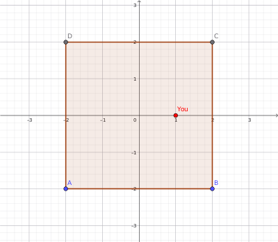
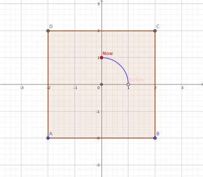

---
jupyter:
  jupytext:
    formats: ipynb,md
    text_representation:
      extension: .md
      format_name: markdown
      format_version: '1.3'
      jupytext_version: 1.18.1
  kernelspec:
    display_name: Python 3 (ipykernel)
    language: python
    name: python3
---

<!-- #region -->
# Numpy Arrays
11/11/2025


## Introduction
In the universe, every interaction we have thus far observed belongs to one of the four fundamental interactions:

* Gravitational
* Electromagnetic
* Strong
* Weak

Weak and strong interactions take place in the subatomic domains while gratvitational and electromagnetic interactions dominate the macroscopic universe.

But when we come to the bottom of it, an interaction is nothing but a manifestation of its corresponding force which either pulls or pushes the participating objects.
<!-- #endregion -->

## Modelling and Representation

In order to study these interactions, we need a way to express them in our equations or in our computers. Similar to the fact that we have sounds to represent concepts like "cat", "food", "planets" and going further, we have letters/characters to represent those sounds in written form, we use symbols to represent physical interactions and objects to build models in order to study them.

Richard Feynman has a nice saying on the issue: "Physics is the poetry of the universe, mathematics is its alphabet."

Consider the (time-independent) Schrödinger equation:

$$\frac{\hbar^2}{2m}\nabla^2\psi(\vec r) + V(\vec r)\psi(\vec r)=E\psi(\vec r)$$

This is a differential equation that relates the wave function $\psi(\vec r)$ change with respect to position. It was derived by Schrödinger in 1925 (and published in 1926). Erwin Schrödinger tackled this equation via the usage of integrals and in the following form:

$$\psi(\vec r)=\psi_0(\vec r)-\frac{m}{2\pi \hbar^2}\int_{\text{all }\vec r'}{\frac{e^{ik|\vec r - \vec r'|}}{|\vec r - \vec r'|}}V\left(\vec r'\right)\psi\left(\vec r'\right)\text{d}^3\vec r'\qquad k = \frac{\sqrt{2mE}}{\hbar}$$

When he did that, there was already an alternative formula that had gained popularity and was rocking the scientific halls. It was proposed by Werner Heisenberg (also in 1925, yet some months earlier than Schrödinger) and looked like this:

$$\hat{H}\psi(\vec r) = E \psi(\vec r)$$

Heisenberg called his nomenclature as 'matrix mechanics'. Both of the equations were proposed to solve the same thing (quantum states) yet at the time they were thought as different theorems. After a harsh confrontation between Heisenberg and Schrödinger, and upon Bohr's advice to Schrödinger, Schrödinger was able to prove that the formulas were in reality the same, yet differing only in representation.

In quantum courses, Schrödinger's integral equations are taught because they are more "human-readable". Alas, in computer calculations Heisenberg's matrix formulism is used because computers "think" in matrices. See that little "^" hat on top of $H$ in the Heisenberg equation? It indicates that $H$ is an _operator_. An operator is an action that acts on objects. In this case, it is acting on the wave function and extracts a scalar (i.e., a number) from it, without changing it. These kind of equations where you extract an information from your object without changing it are called "eigenvalue equations" and they are extremely important in physics (we will see more on them in the future). 

For the moment, let's focus on operators acting on objects. And the simplest way to do it is to rotate an object 90<sup>o</sup> around some axis.

Let's assume that you are in a square shaped classroom and your desk is located as shown in the figure:



Most likely, looking at the figure, you have automatically assumed your position to be (1,0), with the center of the classroom taken as the reference point. Although correct, this is just one of the infinite possibilities to determine your position. But usually we ("the human beings") have a natural tendency to pick the most convenient reference system in our daily lives (thanks to millions of years of evolution!). Also, don't forget that, in real life, there is no labelings, no axes in the classroom -- it is just you sitting at some place close to center, that's it. But we need to express this to the computer, so -for the moment- we have to use mathematics (in its strict sense). So, at this instance, taking the center of the classroom as our reference point, we can write our position as:

$$ \vec r = \begin{bmatrix}1\\0\end{bmatrix}$$

Since we have two parameters (our x and y coordinates), it's a good idea to pack these into a vector as vectors are known to hold different values separetely be it numbers or material properties. Anything you store on a column of an spreadsheet can be treated as a vector (this information will come handy when we begin studying databases).

Back to our classroom case, now imagine that the teacher -for some reason- asked you to "rotate 90<sup>o</sup> counter-clockwise (ccw) with respect to the center of the classroom". This is where you'd find yourself after taking this action:



and you can easily see that your position is now given as:

$$ \vec r' = \begin{bmatrix}0\\1\end{bmatrix}$$

So, to summarize, here is what happened: in the beginning, you were at position $ \vec r = \begin{bmatrix}1\\0\end{bmatrix}$ and then, upon acting on your position (with a _rotation operator_ $\hat R$ ), your position became $ \vec r' = \begin{bmatrix}0\\1\end{bmatrix}$. 

Mathematically, we can represent this story as:

$$\hat R\cdot \vec r = \vec r'$$

(For simplicity, from now on, we will drop the hats ('^') from the top of the operators and the arrows ('\vec\.') from the top of the vectors but try to use capital letters ('A','B',...) for the operators and lowercase letters ('a','b',...) for the vectors and italized format ('_a_','_b_',...) for the scalars (i.e., numbers). So, what we have is:

$$R r = r'$$

Let's see if we can further develop this equation for dealing with it on a computer.


## Multiplication of a matrix with a vector

From basic linear algebra, we know that, there are a variety of vector and matrix (+ tensor) products, most notably:

* Scalar (dot) product    
  $s = \vec a \cdot \vec b = |\vec a| |\vec b| \cos\theta \Leftrightarrow s=\sum_{i}{a_i b_i}\qquad$ ($\theta$ : the angle between the vectors)
* Vector (cross) product  
  $|\vec c| = |\vec a \times \vec b| = |\vec a| |\vec b| \sin\theta$, with the resulting vector $\vec c$ being perpendicular to both $\vec a$ and $\vec b$.
* Matrix - vector product  
  $\vec y = A\cdot\vec x$, such that $y_i=\sum_{j=1}^n a_{ij}x_j$
* Matrix - matrix product  
  $C = AB$, such that $c_{ij} = a_{i1} b_{1j} + a_{i2} b_{2j} + \cdots + a_{in} b_{nj} = \sum_{k=1}^n a_{ik} b_{kj}$

Due to the last definition, an $A$ matrix of dimensions $(m\times n)$ can only be multiplied by a $B$ matrix of dimensions $(n\times p)$ and the resulting $C$ matrix will be of dimensions $(m\times p)$.

$$\begin{pmatrix} & \dots & \\ & \dots & \end{pmatrix}_{(m\times n)}\begin{pmatrix} & \dots & \\ & \dots & \end{pmatrix}_{(n\times p)} = \begin{pmatrix} & \dots & \\ & \dots & \end{pmatrix}_{(m\times p)}$$

Here, the first index in the dimension shows the number of rows, whereas the second index shows the number of columns in the matrix. A value such as $c_{ij}$ indicates the value of the element of the C matrix sitting on the ith row and jth column. So, we can see that the "Matrix - vector product" is actually a special case of the "Matrix - matrix" product as we can treat an m-dimensional vector like a matrix of $(m\times 1)$ dimensions.

Returning to our equation $Rr=r'$, if we explicitly write the dimensions, we have the following structure:

$$\begin{pmatrix} & \dots & \\ & \dots & \end{pmatrix}_{(m\times n)}\begin{pmatrix} & \dots & \\ & \dots & \end{pmatrix}_{(2\times1)} = \begin{pmatrix} & \dots & \\ & \dots & \end{pmatrix}_{(2\times1)}$$

Since the number of the columns of the first matrix ($n$) must match with the number of the rows of the second one (2), we deduce that $n = 2$. Furthermore, as the number of the rows of the resulting matrix (2) must match with the number of the rows of the first matrix ($m$), we have $m=2$. So we find out that, the rotation action in our case can only be represented in mathematical form as a (2x2) matrix, i.e.,

$$R=\begin{pmatrix}a&b\\c&d\end{pmatrix}_{(2\times2)}$$

where $a,b,c,d$ are the coefficients (some numbers) that make up our matrix.


### Derivation of the coefficients
Explicitly writing our equation:

$$Rr=r'\Rightarrow \begin{bmatrix}a&b\\c&d\end{bmatrix} \begin{bmatrix}1\\0\end{bmatrix} = \begin{bmatrix}0\\1\end{bmatrix}$$

Using the formula for the matrix - vector product ($y_i=\sum_{j=1}^n a_{ij}x_j$), we can write the following equations:

1. $a.1 + b.0 = 0$
2. $c.1 + d.0 = 1$

Which gives us two of the elements of $R$  ($a=0$ and $c = 1$):

$$R = \begin{bmatrix}0&b\\1&d\end{bmatrix}$$

What about the other two coefficients $c$ and $d$?

(...)

What if I asked you, now sitting at this new $(0,1)$ position, where would you find yourself if you had rotated 90<sup>o</sup> more? The answer is straightforward: you'd be at (-1,0)! So, we have built ourselves yet another equation:

$$R\begin{bmatrix}0\\1\end{bmatrix} = \begin{bmatrix}-1\\0\end{bmatrix}$$

and plugging in our $R$:

$$\begin{bmatrix}0&b\\1&d\end{bmatrix}\begin{bmatrix}0\\1\end{bmatrix} = \begin{bmatrix}-1\\0\end{bmatrix}$$

gives us:

1. $0.0 + b.1 = -1$
2. $1.0 + d.1 = 0$

from which we deduce that $b=-1$ and $d=0$. 

So we can now write our "90<sup>o</sup> ccw rotator operator $R$" in full form:

$$R=\begin{bmatrix}0&-1\\1&0\end{bmatrix}$$


#### Side note: Classification of sets of linear equations

In our example, we had 4 unknowns ($a,b,c,d$) and thus needed 4 (linearly independent) equations:

1. $a.1 + b.0 = 0$
2. $c.1 + d.0 = 1$
3. $a.0 + b.1 = -1$
4. $c.0 + d.1 = 0$

to solve them _completely_. 

If we call the number of variables ("unknowns") as $m$, and the number of linearly indenpendent equations as $n$, depending on their relation, we will have one of the three possible scenarios:

|Case|Example|Classification|Situation|
|----|----|----|----|
|$m>n$|$\begin{aligned}x+2y&=1\end{aligned}$|Underdetermined system|Infinite number of solutions|
|$m=n$|$\begin{aligned}x+2y &= 1\\3x-5y&=7\end{aligned}$|Well-determined system|Unique solution|
|$m<n$|$\begin{aligned}x+2y &= 1\\3x-5y&=7\\2x+3y&=-5\end{aligned}$|Overdetermined system|No solution|

In physics & materials science, we almost always deal with overdetermined systems as each measurement yields a new equation! But luckily we have the proper tools to deal with it (and actually, as the number of measurements (/equations) increase, we get better and better estimations!)


## Introducing the matrices to computer with NumPy
NumPy library holds the essential objects and methods for dealing with matrices and arrays. Although it has been -in my opinion- superceeded by the JAX library, we will still begin from numpy as it is straight-forward to switch to JAX from numpy.

```python
# Import the numpy library -- "np" is the conventional alias
import numpy as np

# Here comes our first vector -- we describe arrays and 
# matrices in numpy as 'array's
r = np.array([1.,0])
```

```python
r
```

```python
# As you can see, r has been defined as a row vector (1x2)
# instead of a column vector (2x1), but we will come to this
# later.

# and here is our R operator:
R = np.array([[0.,-1],[1,0]])
```

```python
R
```

```python
# Multiplication of matrices with vectors is handled by the
# np.dot() function (it is also the dot product for vectors as 
# you can guess!)

rp = np.dot(R,r)
```

```python
rp
```

So, we had [1,0] vector, acted on it with the $R$ operator (represented as a (2x2) matrix) and got [0,1] in return. Let's apply it once more:

```python
rpp = np.dot(R,rp)
rpp
```

As expected! Let's do it a third time:

```python
rppp = np.dot(R,rpp)
rppp
```

And if we apply it one final time, it should bring us to our original vector 
$𝑟$ :

```python
np.dot(R,rppp)
```

Let's summarize and do all these operations with an arbitrary vector:

```python
a = np.random.uniform(-5,5,2)
print(a)

ap = R@a # alternative notation for dot product
print(ap)

app = R@ap
print(app)

appp = R@app
print(appp)

print(R@appp)
```

**Question**   
Given $r'$, how can you determine the previous position?
