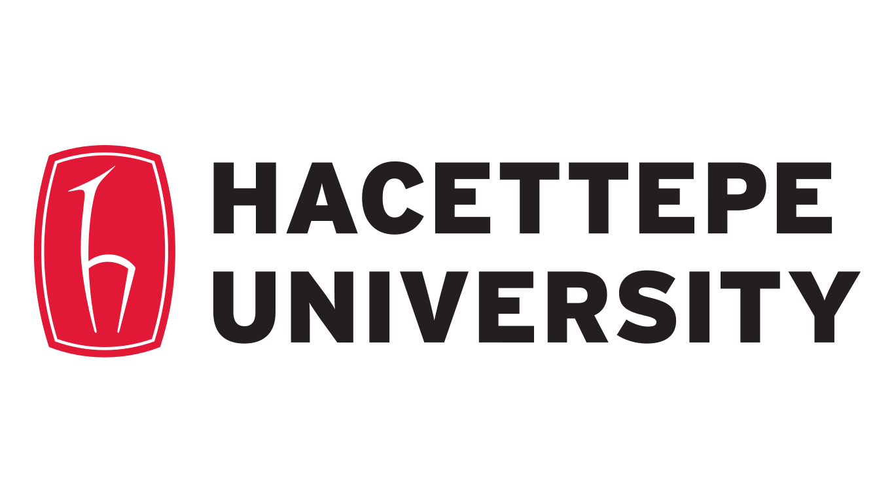

# MGi371
_Casual lectures on coding, group theory, ML and their applications on materials informatics._

Lecture notes for the unofficial MGi371 course given in the 2025-2026 term at the MGi@SHU, during my sabbatical visit.

The level will be basic / no assumptions on what you know about the topics, everything will be handled from scratch.

Dr. Emre S. Tasci <etasci@shu.edu.cn>

&nbsp;&nbsp;

